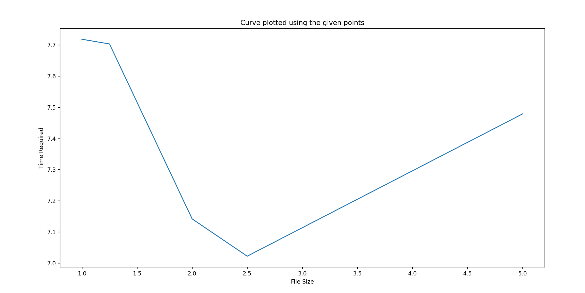
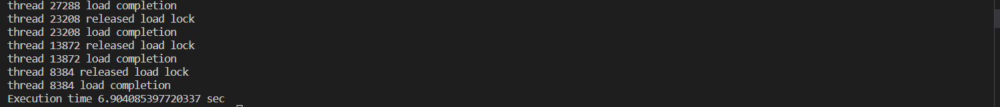

# ETL

#This repository represents a simulation of  the EXTRACT -> TRANSFORM -> LOAD METHOD through a python script.

#How to Run
On running the script three folders for each of the cases are produced, please note that chunkfiles.csv in Case2 folder and 
pipelining.csv in the first folder are redundant and are replaced by five files in Case2 depicting the sizes and a Threading.csv in the main folder
Since entry sizes are rather small times may fluctuate for some set of files

Keep the file in ETL.py in some folder before running 

1. In Approach 1 , A file OnebyOne.csv is generated where we have  a single query  fetched from the database , transformed then loaded.

2. In Approach 2, A file is broken into various chunks and fed to a program and then loaded into the final csv.

3. In Approach 3, Multiple threads work on each file and locking in the  priority order E, T, L.

Given below are the results

